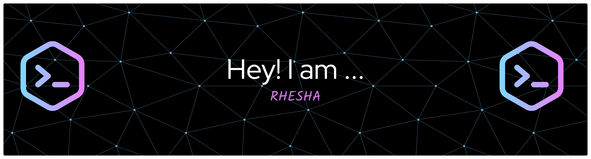

> Driven by curiosity. Grounded by purpose.

MS Computer Science student at USC, building at the intersection of AI research and scalable engineering.

---

### 🔭 What I'm working on
- Explainability in medical vision-language models
- Knowledge editing pipelines in LLMs
- My personal portfolio site

### 🌱 What I'm exploring
- Multimodal AI systems
- Scalable backend architecture
- Making ML models more transparent and trustworthy

### 💼 Previously
- Software Engineer @ BT Group (Openreach) — microservices, Java, distributed systems
- Intern @ Bosch Global Software Technologies — AI/ML mobile app (patent pending)

### 📄 Published in IEEE
[Secure and Intelligent Crop Supply Chain System Using Distributed Ledger Technology and Deep Learning](https://ieeexplore.ieee.org/document/10544073/)

---

---

### 📊 GitHub Stats

---

### 🛠️ Tech Stack

---

### 📫 Let's connect

---
### 👾 GitHub Activity

